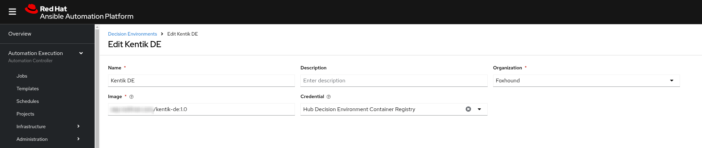

# Custom Kentik Decision Environment
To use the Kentik EDA Plugin, you must build a Decision Environment that contains the `kentik.ansible_eda` collection. 

The file named `kentik-de.yml` is a definition file for use with ansible builder to build a DE based on the official Minimal DE container image, and adds 2 collections:
* ansible.eda
* kentik.ansible_eda

To use the definition file:
1. Populate the ansible.cfg file with the configuration information for Automation Hub to use as a source for your collections
   The information needed can be found in https://console.redhat.com/ansible/automation-hub/token
2. Install Ansible Builder on your machine
3. Generate the build context for the DE using the following command:

   `ansible-builder create -f DecisionEnvironment/kentik-de.yml`

4. Use the Containerfile in this repo as a guide to modify the generated container file in your context directory

   **Note: This step is required as a workaround becaue the collection exposes a requirement that pip fails to find, so this is to bypass that**

5. Navigate to the context directory, and use buildah to build the DE from context:

   `buildah build -t kentik-de:1.0`

6. Once the build is successful push the DE into your Private Automation Hub (or your container registry) 
   ```
   podman login <YOUR_PRIVATE_HUB_URL>
   podman push localhost/kentik-de:1.0 <YOUR_PRIVATE_HUB_URL>/kentik-de:1.0
   ```

7. To use the new DE in Automation Decisions in AAP, Define a New DE pointing to the image you pushed into your PAH/registry. The image Below is a sample of what the New DE definition would look like in AAP:



6. Choose the newly defined DE for any rulebook activation that will require the plugins in the collections found in the new DE.