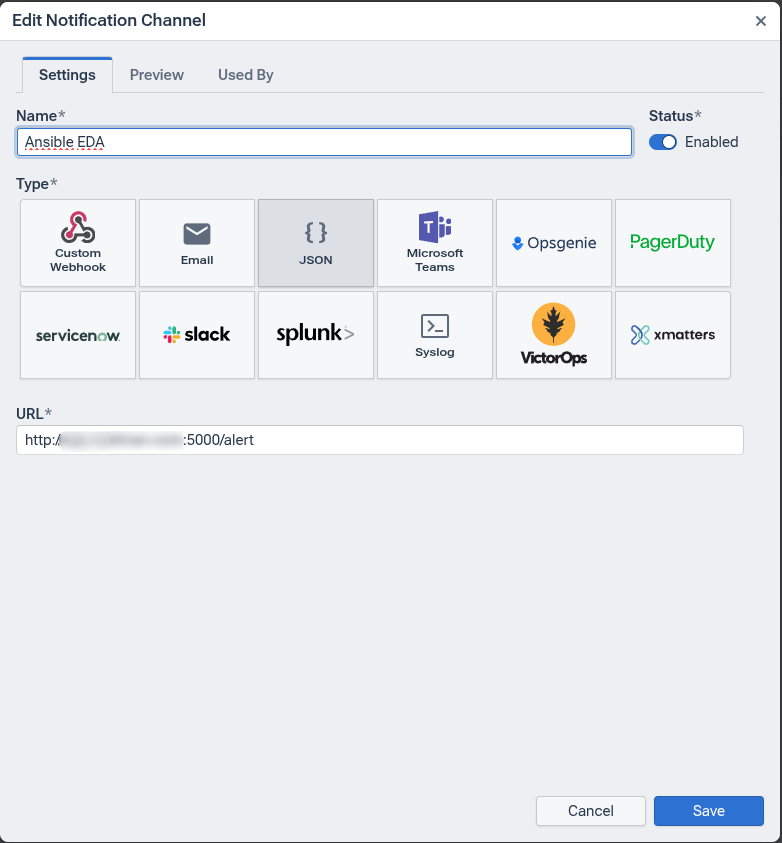
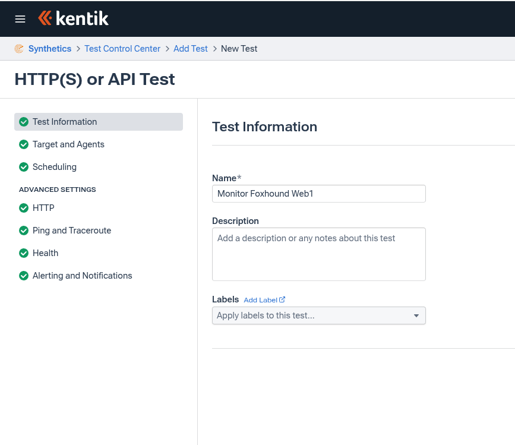
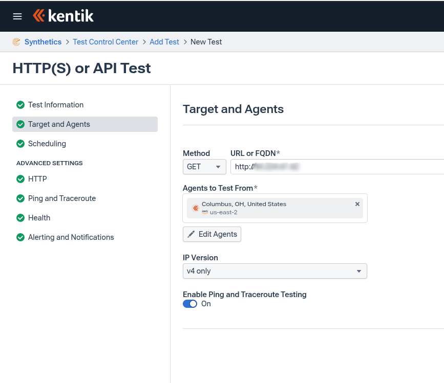
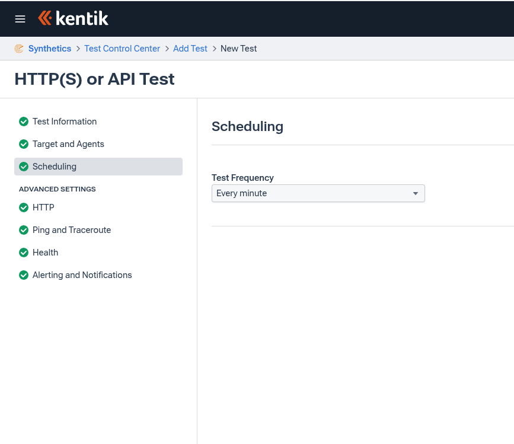
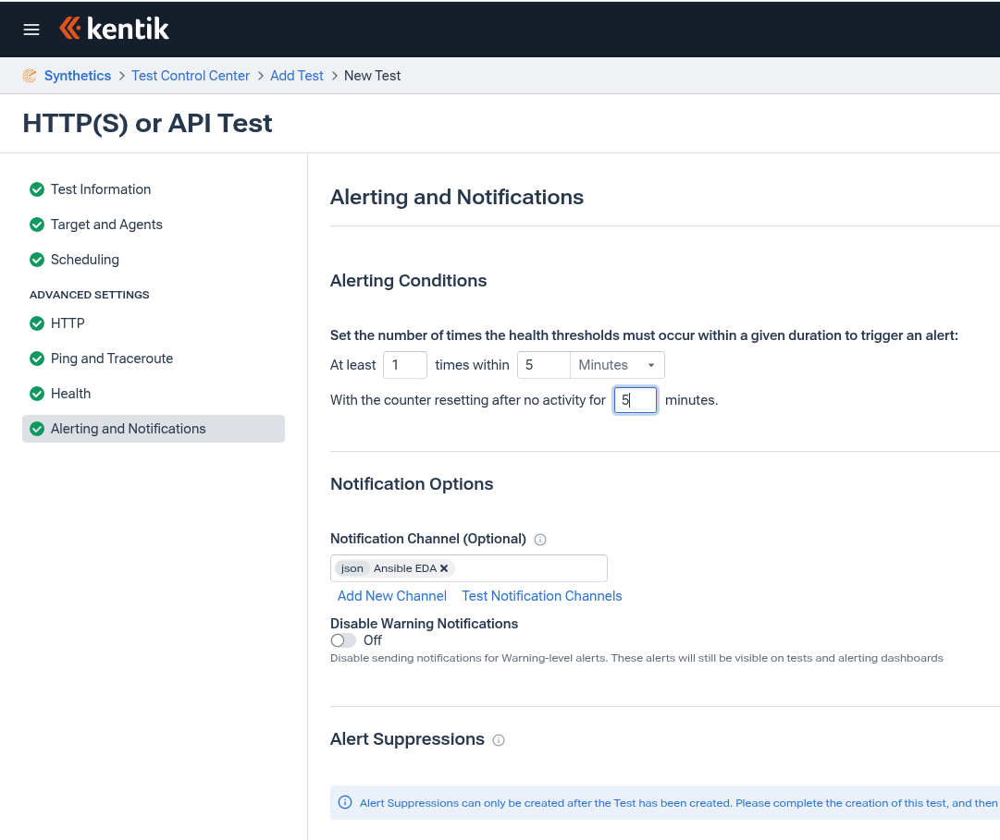

# ansible-eda-kentik

This repo is for demoing Event Driven Ansible's integration with Kentik using the `kentik.ansible_eda` collection.

Notes:

1. You must build a Decusuin Environemnt that has the `kentik.ansible_eda` collection. Please refer to the instructions under the DecisionEnvironemt Folder for steps and a workaround for an existing issue.

2. You can achieve a similar outcome by using the `eda.webhook` plugin.

3. The endpoint to configure in kentik is: `<YOUR_PUBLIC_FACING_EDA_OR_GATEWAY>:<PORT>/alert` - **PLEASE NOTE THE `/alert`**.

# Kentik Setup Steps

After setting up your rulebook activation using one if the rulebooks under the `rulebooks` directory, setup Kentik to forward alerts as follows:

1. logon to `portal.kentik.com`
2. Go to Settings --> Notifications and click on `Add Notification Channel`
3. Enter a name for the channel, Choose JSON for the type and input the EDA endpoint in the format of 

**`<YOUR_PUBLIC_FACING_EDA_OR_GATEWAY>:<PORT>/alert`**

To Setup a sample of a rule, Setup an apache server that will be monitored by kentik. To trigger the alert you can stop the apache service. Use the following steps to configure kentik to monitor an HTTP server:

1. logon to `portal.kentik.com`
2. Go to Synthetics > Test Control Center > Add Test
3. Select Application, Choose HTTP(S) or API
4. Under Test Information Enter the test name 

5. Under Target and Agents enter the URL of the Apache server, and choose an agent that is in a close region to where you set it up

6. Under Scheduling Choose `Every Minute`

7. Under Alerting and Notifications adjust your thresholds as desired, and make sure to select the notification channel you created earlier under `Notification Channel`

8. Save your Test, and Kentik will run a test against that server and change from Pending to Healthy.
9. Trigger an Alert by stopping the apache service.

Note: You can send a test alert by clicking on the `Test Notification Channels` button in the Test setup page